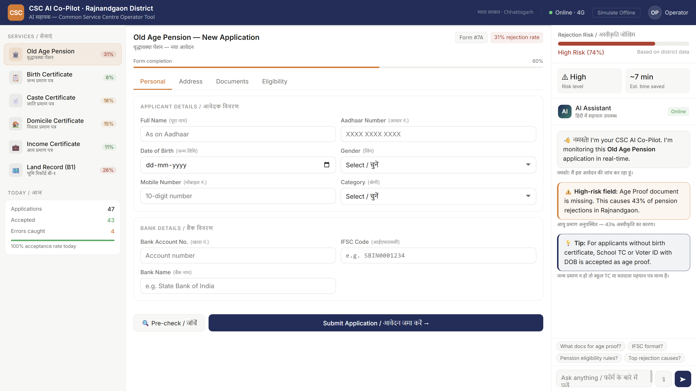

# CSC AI Co-Pilot
**AI-powered assistant for Common Service Centre operators · Rajnandgaon, Chhattisgarh**


---

CSC operators in Rajnandgaon process **70–90 government applications per day** — pensions, certificates, licenses — on slow portals with no guidance. Every mistake causes a rejection that bounces back days later. This tool catches errors **before** submission.

---

## Screenshot

> **Main interface** — Service selector (left) · Live form with real-time validation (centre) · AI assistant with rejection risk meter (right)



> **How to add your screenshot:**
> 1. Run the app (`start.bat`)
> 2. Open `http://localhost:3000`
> 3. Press `Win + Shift + S` → select the full app window
> 4. Save as `screenshot.png` in the project root folder
> 5. Push to GitHub — the image will appear here automatically

---

## What It Does

| Feature | Detail |
|---|---|
| **Live field validation** | Aadhaar checksum, IFSC format, mobile, age, pincode — validated as you type |
| **AI chat assistant** | Ask anything in Hindi or English — concise bilingual answers via Claude |
| **Rejection risk meter** | Score updates live; blocks submission if risk exceeds 65% |
| **Document checklist** | Shows missing documents with district-level rejection rate per document |
| **Eligibility inference** | Checks age, residency, income against service rules before submission |
| **Offline mode** | All validators work without internet; AI falls back to cached responses |
| **6 government services** | Pension · Birth · Caste · Domicile · Income · Land Record |

---

## Quick Start

```bash
# 1. Clone
git clone https://github.com/YOUR-USERNAME/csc-ai-copilot.git
cd csc-ai-copilot

# 2. Add your Anthropic API key
# Edit backend/.env and set:
# ANTHROPIC_API_KEY=sk-ant-...

# 3. Run (Windows)
start.bat

# 3. Run (Mac/Linux)
chmod +x start.sh && ./start.sh
```

Open **http://localhost:3000** in your browser.

Get your API key at → https://console.anthropic.com

---

## Tech Stack

```
Frontend    React 18 · axios · react-hot-toast · pure CSS
Backend     Node.js · Express.js · lowdb · dotenv · helmet
AI Model    Claude Sonnet (claude-sonnet-4-20250514) via Anthropic SDK
Validation  Verhoeff algorithm · regex engine · rule-based scoring
Database    lowdb JSON (upgradeable to MongoDB / PostgreSQL)
Deployment  Docker · nginx · docker-compose
```

---

## Project Structure

```
csc-copilot/
├── backend/
│   ├── server.js              # Express entry point
│   ├── routes/
│   │   ├── ai.js              # Claude AI chat + analysis
│   │   ├── validate.js        # Aadhaar, IFSC, mobile, age, pincode
│   │   ├── applications.js    # Application CRUD + submit
│   │   ├── analytics.js       # Rejection patterns + dashboard
│   │   └── services.js        # Service definitions + eligibility rules
│   └── db/database.js         # lowdb JSON database + seeding
├── frontend/
│   └── src/
│       ├── components/
│       │   ├── Header.js      # Network status + offline toggle
│       │   ├── Sidebar.js     # Service selector + daily stats
│       │   ├── FormPanel.js   # 4-tab form
│       │   ├── AIPanel.js     # Claude chat + risk meter
│       │   └── tabs/          # PersonalTab · AddressTab · DocumentsTab · EligibilityTab
│       ├── hooks/
│       │   └── useNetworkStatus.js   # Online/offline/2G detection
│       └── utils/
│           ├── api.js                # Axios API client
│           └── validators.js         # Offline-first validators + risk calculator
├── docker-compose.yml
├── start.bat                  # Windows one-click start
├── start.sh                   # Mac/Linux one-click start
└── README.md
```

---

## Rejection Patterns (Pre-loaded · Rajnandgaon District)

| Service | Top Rejection Cause | Rate |
|---|---|---|
| Old Age Pension | Age proof missing | 43% |
| Old Age Pension | Wrong IFSC code | 28% |
| Birth Certificate | Hospital cert missing | 55% |
| Caste Certificate | Wrong form submitted | 38% |
| Income Certificate | Income source proof missing | 45% |
| Land Record | Khasra number mismatch | 38% |

---

## Environment Variables

```bash
# backend/.env
ANTHROPIC_API_KEY=sk-ant-...        # Required — get from console.anthropic.com
PORT=5000                            # Backend port
NODE_ENV=development
FRONTEND_URL=http://localhost:3000
```

---

## Problem Statement

Built for **PS 01 · AI Co-Pilot for CSC Operators** · GovTech · AI for Citizen Services

> *"Design and build an intelligent assistant for frontline CSC operators that reduces form rejections and cuts per-application handling time without replacing the operator's judgment."*

---

## License

MIT — free to use, modify, and deploy.